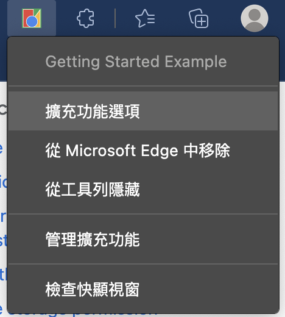

# Get Started
This tutorial will build an extension that allows the user to change the background color of the currently focused page. It will use many of the extension platform's components to give an introductory demonstration of their relationships

To start, create a new directory to hold the extension's files.

## Create the manifest
Extensions start with their manifest. Create a file called **manifest.json** and include the following code.

```json
{
  "name": "Getting Started Example",
  "description": "Build an Extension!",
  "version": "1.0",
  "manifest_version": 3
}
```

## Add functionality
### Register the background script in the manifest
Background scripts must be registered in the manifest. Registering a background script in the manifest tells the extension which file to reference, and how that file should behave.

```json
{
  "name": "Getting Started Example",
  "description": "Build an Extension!",
  "version": "1.0",
  "manifest_version": 3,
  "background": {
    "service_worker": "background.js"
  }
}
```

Chrome is aware that the extension includes a service worker. When the extension is reloaded, Chrome will scan the specified file for additional instructions, such as important events it needs to listen for.

### Create the background script
Create a new file named **background.js** and add the following code.

```javascript
// background.js

let color = '#3aa757';

chrome.runtime.onInstalled.addListener(() => {
  chrome.storage.sync.set({ color });
  console.log('Change the default background color to %cgreen', `color: ${color}`);
});
```

This extension will need information from a persistent variable as soon as it's installed. Start by including a listening event for **runtime.onInstalled** in the background script. Inside the onInstalled listener, the extension will set a value using the **storage** API. This will allow multiple extension components to access that value and update it. 

### Add the storage permission
Most APIs must be registered under the "permissions" field in the manifest for the extension to use them, such as **storage** API.

## Import the extension
Follow the below steps to add the extension whose directory holding a manifest file in developer mode in its current state: 
1. Open the **Extension Management(套件管理員)** page by navigating to **chrome://extensions**.
2. Enable Developer Mode by clicking the toggle switch next to **Developer mode(開發人員模式)**.
3. Click the **Load unpacked(載入解壓縮)** button and select the extension directory.
4. A new field, **Inspect views**, becomes available with a blue link, **service worker**.
5. Click the link to view the background script's console log which prints "Default background color set to green".

## Introduce a user interface
In this case to use a popup as the user interface. Create and add a file named **popup.html** which uses a button to change the background color.

```html
<!DOCTYPE html>
<html>
  <head>
    <link rel="stylesheet" href="button.css">
  </head>
  <body>
    <button id="changeColor"></button>
  </body>
</html>
```

This popup's HTML references an external CSS file named **button.css**. Add another file then name it appropriately, and add the following code.
```css
button {
  height: 30px;
  width: 30px;
  outline: none;
  margin: 10px;
  border: none;
  border-radius: 2px;
}

button.current {
  box-shadow: 0 0 0 2px white,
              0 0 0 4px black;
}
```

Add an action object to the manifest and set **popup.html** as the action's **default_popup** in the manifest for Chrome to present it in the extension's popup.

```json
{
  "name": "Getting Started Example",
  "description": "Build an Extension!",
  "version": "1.0",
  "manifest_version": 3,
  "background": {
    "service_worker": "background.js"
  },
  "permissions": ["storage"],
  "action": {
    "default_popup": "popup.html"
  }
}
```

Designation for toolbar icons is also included under **action** in the **default_icons** field. Update the manifest for the extension how to use the images.
```json
{
  "name": "Getting Started Example",
  "description": "Build an Extension!",
  "version": "1.0",
  "manifest_version": 3,
  "background": {
    "service_worker": "background.js"
  },
  "permissions": ["storage"],
  "action": {
    "default_popup": "popup.html",
    "default_icon": {
      "16": "/asserts/get_started16.png",
      "32": "/asserts/get_started32.png",
      "48": "/asserts/get_started48.png",
      "128": "/asserts/get_started128.png"
    }
  }
}
```
Extensions also display images on the extension management page, the permissions warning, and favicon. These images are designated in the manifest under **icons**.
```json
{
  "name": "Getting Started Example",
  "description": "Build an Extension!",
  "version": "1.0",
  "manifest_version": 3,
  "background": {
    "service_worker": "background.js"
  },
  "permissions": ["storage"],
  "action": {
    "default_popup": "popup.html",
    "default_icon": {
      "16": "/asserts/get_started16.png",
      "32": "/asserts/get_started32.png",
      "48": "/asserts/get_started48.png",
      "128": "/asserts/get_started128.png"
    }
  },
  "icons": {
    "16": "/asserts/get_started16.png",
    "32": "/asserts/get_started32.png",
    "48": "/asserts/get_started48.png",
    "128": "/asserts/get_started128.png"
  }
}
```

Try to reload the extension to make sure that the settings will be taken effect. The last step for the popup page is adding color to the button. Create and add a file named **popup.js** with the following code: 

```javascript
// Initialize button with user's preferred color
let changeColor = document.getElementById("changeColor");

chrome.storage.sync.get("color", ({ color }) => {
  changeColor.style.backgroundColor = color;
});
```

This code grabs the button from popup.html and requests the color value from storage. It then applies the color as the background of the button. Include a script tag to popup.js in popup.html. Reload the extension to view the green button.

```html
<!DOCTYPE html>
<html>
  <head>
    <link rel="stylesheet" href="button.css">
  </head>
  <body>
    <button id="changeColor"></button>
    <script src="popup.js"></script>
  </body>
</html>
```

## Layer logic
The extension now has a custom icon and a popup, and it colors the popup button based on a value saved to the extension's storage. 
Next for further user interaction. Update popup.js by adding the following to the end of the file.

```javascript
// When the button is clicked, inject setPageBackgroundColor into current page
changeColor.addEventListener("click", async () => {
  let [tab] = await chrome.tabs.query({ active: true, currentWindow: true });

  chrome.scripting.executeScript({
    target: { tabId: tab.id },
    function: setPageBackgroundColor,
  });
});

// The body of this function will be executed as a content script inside the
// current page
function setPageBackgroundColor() {
  chrome.storage.sync.get("color", ({ color }) => {
    document.body.style.backgroundColor = color;
  });
}
```

The updated code adds a click event listener to the button, which triggers a programmatically injected content script. This turns the background color of the page the same color as the button. Using programmatic injection allows for user-invoked content scripts, instead of auto inserting unwanted code into web pages.

The manifest will need the **activeTab** permission to allow the extension temporary access to the current page, and the **scripting** permission to use the Scripting API's executeScript method.

```json
{
  "name": "Getting Started Example",
  ...
  "permissions": ["storage", "activeTab", "scripting"],
  ...
}
```

## Give users options
The extension currently only allows to set the background to green. Let's start by creating a file named **options.html** and include the following code.. 

```html
<!DOCTYPE html>
<html>
  <head>
    <link rel="stylesheet" href="button.css">
  </head>
  <body>
    <div id="buttonDiv">
    </div>
    <div>
      <p>Choose a different background color!</p>
    </div>
  </body>
  <script src="options.js"></script>
</html>
```

And then place the options page in the manifest.
```json
{
    "name": "Getting Started Example",
    ...
    "options_page": "options.html"
  }
```

Reload the extension, right-click the extension icon in the toolbar and then select **Options**. 



The last step is to add the options logic. Create a file named **options.js**  with the following code.
```javascript
let page = document.getElementById("buttonDiv");
let selectedClassName = "current";
const presetButtonColors = ["#3aa757", "#e8453c", "#f9bb2d", "#4688f1"];

// Reacts to a button click by marking the selected button and saving
// the selection
function handleButtonClick(event) {
  // Remove styling from the previously selected color
  let current = event.target.parentElement.querySelector(
    `.${selectedClassName}`
  );
  if (current && current !== event.target) {
    current.classList.remove(selectedClassName);
  }

  // Mark the button as selected
  let color = event.target.dataset.color;
  event.target.classList.add(selectedClassName);
  chrome.storage.sync.set({ color });
}

// Add a button to the page for each supplied color
function constructOptions(buttonColors) {
  chrome.storage.sync.get("color", (data) => {
    let currentColor = data.color;
    // For each color we were provided…
    for (let buttonColor of buttonColors) {
      // …create a button with that color…
      let button = document.createElement("button");
      button.dataset.color = buttonColor;
      button.style.backgroundColor = buttonColor;

      // …mark the currently selected color…
      if (buttonColor === currentColor) {
        button.classList.add(selectedClassName);
      }

      // …and register a listener for when that button is clicked
      button.addEventListener("click", handleButtonClick);
      page.appendChild(button);
    }
  });
}

// Initialize the page by constructing the color options
constructOptions(presetButtonColors);
```
The **options.html** provides 4 different background colors. When the button is clicked, the extension storage will be updated.